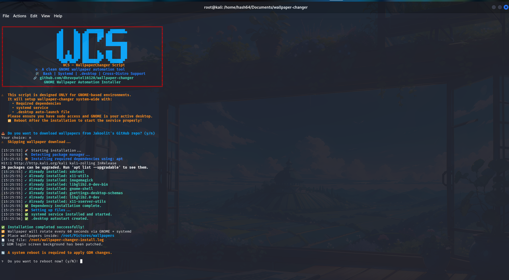

# 🎨 WCS – GNOME Wallpaper Changer Script



> **Fully automated, blazing fast wallpaper rotation for GNOME Desktop with GDM login screen support – written entirely in pure Bash.**

---


---

## 📚 Table of Contents

- [🧠 Overview](#overview)  
- [✨ Features](#features)  
- [📸 Preview](#preview)  
- [🛠 Tech Stack](#tech-stack)  
- [📁 Project Structure](#project-structure)  
- [💻 Installation](#installation)  
- [🧪 Usage](#usage)  
- [🧹 Uninstallation](#uninstallation)  
- [📄 License](#license)  
- [🙌 Contributing](#contributing)

---

## 🧠 Overview

**WCS – Wallpaper Changer Script** is a clean, lightweight Bash solution for **automatically rotating desktop wallpapers** every minute on GNOME-based Linux systems.

> 🎯 It also updates the **GDM login screen wallpaper** and includes a systemd service with autostart support for persistent operation.

---

## ✨ Features

✅ 100% Bash – no Python or Node.js dependencies  
✅ Supports `.jpg`, `.jpeg`, `.png` image formats  
✅ Updates both desktop and GDM login background  
✅ Integrated with `systemd` for background rotation  
✅ Full GNOME support (tested on Kali, Ubuntu, Fedora)  
✅ .desktop autostart for session startup  
✅ Auto-pause when fullscreen apps or games are running  
✅ Minimal resource usage  
✅ Easy to install/uninstall

---

## 📸 Preview

```
╔══════════════════════════════════════════════════════════════════════════╗
║                          ▄█     █▄   ▄████████  ▄███████▄                ║
║                         ███     ███ ███    ███ ███                       ║
║                         ███     ███ ███    █▀  ███                       ║
║                         ███     ███ ███        ██████████                ║
║                         ███     ███ ███               ███                ║
║                         ███  █  ███ ███    █▄  ███    ███                ║
║                         ███ ███ ███ ███    ███ ███    ███                ║
║                          ▀███▀███▀  ████████▀   ▀██████▀                 ║
║                            WCS — WallpaperChanger Script                 ║
║               ⚙️ A clean GNOME wallpaper automation tool                 ║
║               🛠️ Bash | Systemd | .desktop | Cross-Distro Support        ║
╚══════════════════════════════════════════════════════════════════════════╝
```

---

## 🛠 Tech Stack

| Tool              | Purpose                     |
|------------------|-----------------------------|
| `Bash`           | Core scripting language     |
| `systemd`        | Background service          |
| `xdotool`        | Fullscreen detection        |
| `gsettings`      | GNOME wallpaper control     |
| `libglib2.0-dev-bin` | GDM wallpaper configuration |
| `ImageMagick`    | Image handling (optional)   |

---

## 📁 Project Structure

```
📁 wallpaper-changer/
├── 🛠️  install.sh                    # 🔧 Auto-installer script (dependencies, integration)
├── 🧹 uninstall.sh                  # 🚫 Uninstaller script (clean removal)
├── 📘 README.md                     # 📄 Project overview, features & usage
├── 📄 LICENSE                       # 📜 MIT License
├── 🖼️  preview.png                  # 📸 Screenshot or demo image (optional)
│
├── 📂 scripts/                      # 🧠 Core functional logic
│   └── 🎯 wallpaper-changer.sh      # 🎨 GNOME & GDM wallpaper changer logic
│
├── 📂 system/                       # 🧩 System integration (autostart & services)
│   ├── ⚙️ wallpaper-changer.service # 💡 systemd service for boot-time execution
│   └── 🖥️ wallpaper-changer.desktop # 🖱️  Desktop launcher (Applications menu)
```

---

## 💻 Installation

### 🔧 Prerequisites

Ensure you are running:
- GNOME Desktop Environment
- Linux distro with `apt` or `dnf` support

### 🛠 Install Dependencies

```bash
sudo apt update
sudo apt install xdotool x11-utils imagemagick libglib2.0-dev-bin gsettings-desktop-schemas gnome-shell -y
```

### 📥 Install Script

```bash
git clone https://github.com/your-username/wallpaper-changer.git
cd wallpaper-changer
chmod +x install.sh
sudo ./install.sh
```

---

## 🧪 Usage

- 🖼️ Place your wallpapers inside:

```bash
~/Pictures/wallpapers
```

- 🔁 The wallpaper will automatically rotate every **60 seconds**
- 🚫 It pauses while **fullscreen apps or games** are running
- 🖥️ Login screen wallpaper will also update to match

---

## 🔧 Manage the Service

```
# Enable at boot
systemctl --user enable wallpaper.service

# Start manually
systemctl --user start wallpaper.service

# Check status
systemctl --user status wallpaper.service
```

---

## 🧹 Uninstallation

Run the following to cleanly remove all files:

```
chmod +x uninstall.sh
sudo ./uninstall.sh
```

This will:
- ❌ Stop and disable systemd service
- ❌ Remove `.desktop` file
- ❌ Delete all related configs
- 🧹 Leave your wallpapers untouched

---

## 📄 License

This project is licensed under the **MIT License**  
See the [LICENSE](LICENSE) file for details.

---

## 🙌 Contributing

Contributions are welcome! If you can:

- Improve GDM detection or compatibility
- Add new desktop environment support
- Reduce dependencies
- Refactor Bash to POSIX or ZSH-compatible logic

### Fork and PR 🚀

```bash
git checkout -b fix/your-fix
git commit -am "fix: description of your fix"
git push origin fix/your-fix
```

---

## 📬 Contact

Made with 🖤 by [@dhruvpatel16120](https://github.com/dhruvpatel16120/)

> 💬 For suggestions, ideas, or bugs — open an issue or drop a pull request!

---
